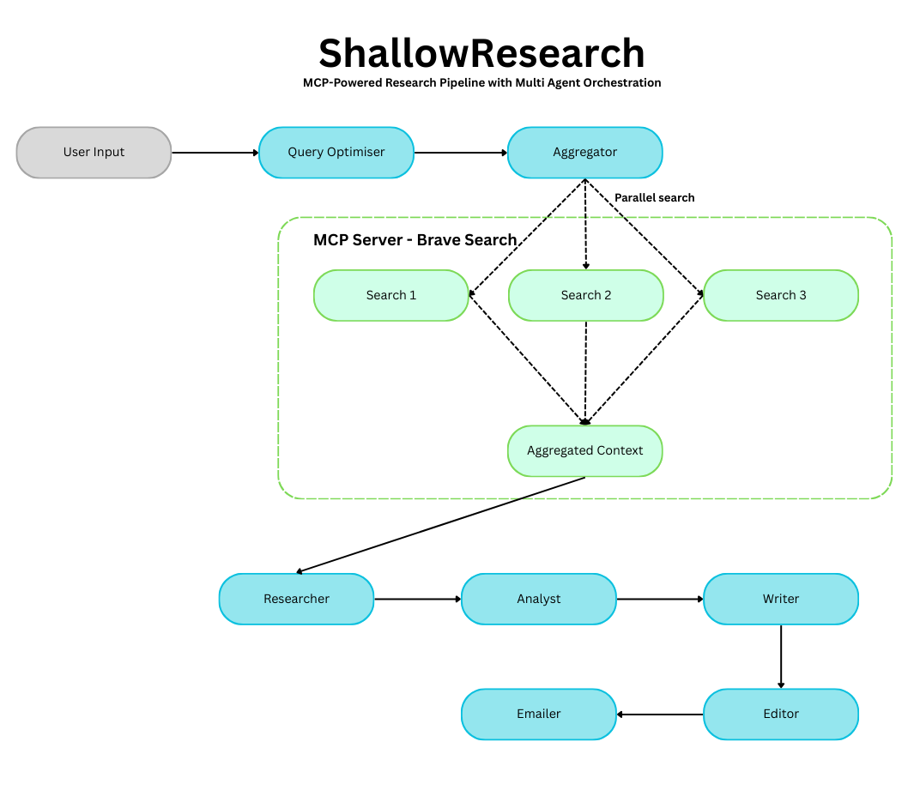

# ShallowResearch - A poor man's deep research (this is a POC for learning purposes)

## Why akka (and actors)

This is a simple POC demonstrating how we can use the actor model to implement AI agents.

The actor model providers a framework for building concurrent and distributed applications by encapsulating state 
and behaviour within asynchronous, message-driven actors.

This model aligns well with Agentic workflows where autonomous agents pursue goals through multi-step reasoning 
and collaboration.


## MCP (Model Context Protocol)

This proof of concept uses [Anthropic's MCP](https://docs.anthropic.com/en/docs/agents-and-tools/mcp) to augment agents with tools. 
Specifically, it implements a MCP Server in Java that uses the Brave Search API for querying the web. 

On the client side, it implements an OpenAI MCP Client capable of using tools defined in the MCP server.
You can inspect both client and server under the `com.theleoborges.researchagent.mcp.servers.*` package.

Thanks to MCP, adapting this application to work with additional servers would be trivial, leveraging the work of 
the open-source developer community.


## Agents

The system has the following agents:

* QueryOptimiser - Uses the LLM to expand the user's topic into 3 search engine optimised queries
* Aggregator - Orchestrates multiple Search agents and collects the results into a combined Context for subsequent agents
* Search - Uses tools to find content relevant to the user's query (this is where the MCP protocol is implemented)
* Research - Does extensive research based on training data and provided search context
* Analysis - Transforms research into structured insights
* Writer - Turns the analysis into an authoritative article
* Report - Performs editorial review focusing on content and presentation quality
* Email  - Sends the report to the specified email address once ready

The high level design is shown below:



### Tools

The Search agent depends on the Brave Search Tool which is a simple wrapper around the Brave Search API. 
Additionally, all other agents leverage OpenAI as their LLM provider.

### Coordinator

The `ResearchCoordinaor` class triggers the first message to the system, `StartReserach`. 
It also sets up all event handlers to respond to the actions of additional agents. 


## Setup

You'll need Java 23 installed. Next, configure your environment variables:

```
    $ cp src/main/resources/env.sample cp src/main/resources/.env
```

Modify the environment variables accordingly to include your own API keys. 
You'll need keys for Open AI  and the Brave Search Engine.

## Running

### IntelliJ

Add the `.env` environment file into your run config. You should be good to go.

### Command Line

Use gradle:

```
    $ ./gradlew runSystem
```

This will run the system and perform research of the default topic.

To specify your own topic, run the following:

```
    # note the single quotes wrapping the topic
    ./gradlew runSystem -Pargs="'topic to research'"
```

## A note on the MCP server

The MCP server implemented in this repo uses STDIO for in process communication. 
For that reason, the server needs to be run as a fat jar. The repo has one already built but if you make changes to 
the server, you'll need to rebuild the fat jar:

```
    $ ./gradlew clean build
```


# Output

The final output of the system will be available in `results/finalReport.md` in a few minutes after startup (check the logs). 
In that directory you will find the output of each intermediate agents as well. 
The repo contains the results for a full run of the default topic. I have also included a PDF version of what the final report could look like. 